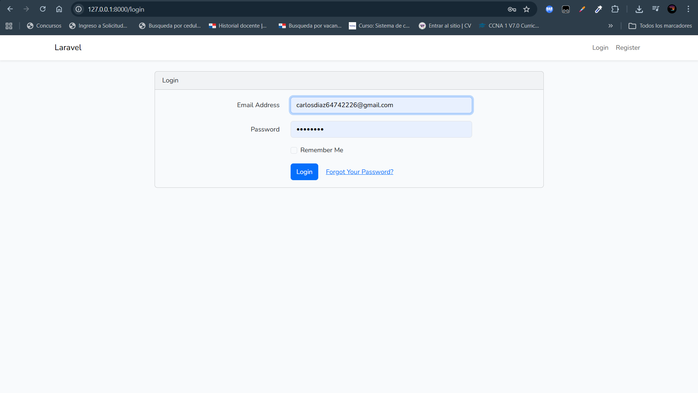
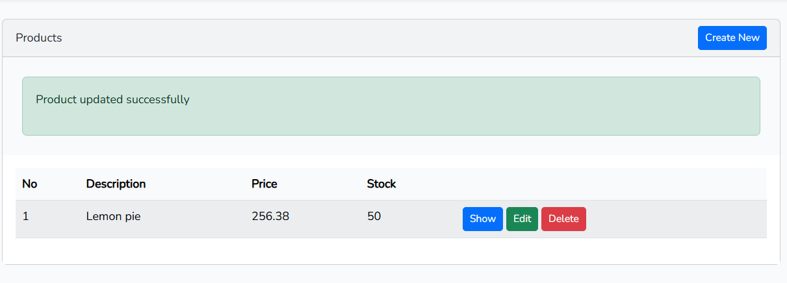

# CRUD Rápido - Sistema de Gestión de Productos


## 📌 Introducción

**CRUD Rápido** es una aplicación web desarrollada con Laravel que proporciona un sistema completo de gestión de productos (CRUD: Create, Read, Update, Delete). Este proyecto implementa el patrón Modelo-Vista-Controlador (MVC) y cuenta con un sistema de autenticación integrado para controlar el acceso a las funcionalidades.

Laravel estructura la aplicación en diferentes capas para facilitar su desarrollo y mantenimiento:

- **Modelo (Model)**: Representa la estructura de la base de datos (ejemplo: tabla products)
- **Vista (View)**: Interfaz gráfica del usuario con diseño responsive
- **Controlador (Controller)**: Contiene la lógica de negocio de la aplicación
- **Rutas (Routes)**: Definen las URLs y conectan con los controladores

## 🎯 Objetivo

- Implementar un CRUD completo de productos
- Crear un sistema de autenticación y autorización
- Desarrollar una interfaz de usuario responsiva con Bootstrap 5 y Tailwind CSS
- Comprender la arquitectura MVC en Laravel
- Gestionar la base de datos con migraciones y eloquent

## ⚙️ Requisitos Previos

Para la ejecución de este proyecto se requieren las siguientes herramientas:

| Herramienta | Versión | Descripción |
|-------------|---------|-------------|
| PHP | 8.0+ | Lenguaje de programación utilizado por Laravel |
| Composer | Última | Gestor de dependencias para PHP |
| Laravel | 13.x | Framework de desarrollo web |
| MySQL | 5.7+ | Sistema gestor de base de datos |
| Node.js | 14.0+ | Entorno de ejecución para JavaScript |
| NPM | 6.0+ | Gestor de paquetes frontend |
| WAMP/LAMP | Última | Servidor web local |
| Visual Studio Code | Última | Editor de código |
| Git | Última | Control de versiones |

## 🛠️ Verificación de Instalación

```bash
php -v
composer -V
node -v
npm -v
```

## 🚀 Instalación
**1. Clonar o descargar el proyecto**
```git clone <URL_DEL_REPOSITORIO>
cd crud_rapido
```

**2. Instalar dependencias de PHP**
```
composer install
```

**3. Instalar dependencias de Node.js**
```
npm install
```

## ⚙️ Configuración del Entorno

**Editar el archivo .env**
**Abre el archivo .env en la raíz del proyecto y configura los siguientes parámetros:**

```
APP_NAME="CRUD Rápido"
APP_ENV=local
APP_KEY=base64:... (se genera automáticamente)
APP_DEBUG=true
APP_URL=http://localhost:8000

DB_CONNECTION=mysql
DB_HOST=127.0.0.1
DB_PORT=3306
DB_DATABASE=crud_rapido
DB_USERNAME=root
DB_PASSWORD=
```

**Limpiar configuración en caché**
```
php artisan config:clear
php artisan config:cache
```

## 🗄️ Base de Datos
**Crear la base de datos en MySQL**
```
CREATE DATABASE crud_rapido CHARACTER SET utf8mb4 COLLATE utf8mb4_unicode_ci;
```
**Ejecutar migraciones**
```
php artisan migrate
```
Este comando crea todas las tablas necesarias:

- users: Gestión de usuarios del sistema
- products: Tabla principal de productos
- migrations: Registro de migraciones ejecutadas
- sessions: Gestión de sesiones
- cache: Caché de la aplicación
- jobs: Trabajos en cola

## 🔐 Autenticación
**El proyecto incluye un sistema completo de autenticación usando Laravel UI con Bootstrap 5:**
```
composer require laravel/ui
php artisan ui bootstrap --auth
npm install
npm run dev
```

**Funcionalidades de autenticación:**
- Registro de nuevos usuarios
- Login con validación
- Recuperación de contraseña
- Cierre de sesión
- Panel de control protegido
  
## ▶️ Ejecución del Proyecto
**1. Compilar assets frontend**
```
npm run dev
```

**2. Iniciar el servidor de desarrollo**
```
php artisan serve
```
El proyecto estará disponible en:
```
http://127.0.0.1:8000
```

**3. Acceso**
- URL Principal: http://127.0.0.1:8000
- Login: http://127.0.0.1:8000/login
- Registro: http://127.0.0.1:8000/register
- Panel de Productos: http://127.0.0.1:8000/products (requiere autenticación)

## 📁 Estructura del Proyecto
```
crud_rapido/
├── app/
│   ├── Http/
│   │   ├── Controllers/        # Controladores de la aplicación
│   │   └── Requests/           # Form Requests para validación
│   └── Models/                 # Modelos Eloquent
│       ├── User.php            # Modelo de usuarios
│       └── Product.php         # Modelo de productos
├── database/
│   ├── migrations/             # Migraciones de base de datos
│   ├── seeders/                # Seeders para datos de prueba
│   └── factories/              # Factories para testing
├── resources/
│   ├── css/                    # Estilos CSS
│   ├── sass/                   # Archivos SASS
│   ├── js/                     # Scripts JavaScript
│   └── views/                  # Vistas Blade
│       ├── layouts/            # Diseños base
│       ├── auth/               # Vistas de autenticación
│       ├── product/            # Vistas de productos
│       └── home.blade.php      # Home page
├── routes/
│   ├── web.php                 # Rutas web
│   └── console.php             # Comandos de consola
├── public/
│   ├── index.php               # Punto de entrada
│   └── build/                  # Assets compilados
├── config/
│   ├── app.php                 # Configuración principal
│   ├── database.php            # Configuración de base de datos
│   └── ...                     # Otras configuraciones
├── .env                        # Variables de entorno (no versionar)
├── .env.example                # Ejemplo de configuración
├── vite.config.js              # Configuración de Vite
├── package.json                # Dependencias frontend
├── composer.json               # Dependencias PHP
└── README.md                   # Este archivo
```

## 📚 Modelos y Relaciones
**User (Usuario)**
```
<?php
namespace App\Models;

use Laravel\Sanctum\HasApiTokens;
use Illuminate\Notifications\Notifiable;
use Illuminate\Foundation\Auth\User as Authenticatable;

class User extends Authenticatable
{
    use HasApiTokens, Notifiable;
    
    protected $fillable = ['name', 'email', 'password'];
}
```

**Product (Producto)**
```
<?php
namespace App\Models;

use Illuminate\Database\Eloquent\Model;

class Product extends Model
{
    protected $fillable = ['name', 'description', 'price', 'quantity'];
}
```

## 🎨 Funcionalidades Principales

**CRUD de Productos**

✅ Crear (C): Agregar nuevos productos

✅ Leer (R): Listar y ver detalles de productos

✅ Actualizar (U): Editar información de productos

✅ Eliminar (D): Borrar productos del sistema

**Características de Seguridad**

- Autenticación obligatoria para acceder a productos
- Validación de formularios en servidor
- Protección CSRF en todos los formularios
- Contraseñas encriptadas con bcrypt
- Middleware de autenticación en rutas protegidas

**Diseño Responsivo**

- Bootstrap 5 para componentes UI
- Tailwind CSS para utilidades
- Vistas optimizadas para dispositivos móviles
- Interfaz intuitiva y amigable

## 🧠 Comandos Importantes

```
# Migraciones
php artisan migrate              # Ejecutar migraciones
php artisan migrate:rollback     # Deshacer última migración
php artisan migrate:reset        # Deshacer todas las migraciones
php artisan migrate:refresh      # Refrescar base de datos

# Seeders
php artisan db:seed              # Ejecutar seeders
php artisan tinker               # Shell interactivo de Laravel

# Servidor
php artisan serve                # Iniciar servidor de desarrollo
php artisan serve --host=0.0.0.0 --port=8000  # Especificar host y puerto

# Assets
npm run dev                       # Compilar assets en desarrollo
npm run build                     # Compilar assets para producción
npm run watch                     # Monitorear cambios en assets

# Caché y configuración
php artisan config:clear         # Limpiar caché de configuración
php artisan cache:clear          # Limpiar caché general
php artisan view:clear           # Limpiar caché de vistas

# Base de datos
php artisan make:migration create_table_name  # Crear migración
php artisan tinker               # Acceso a consola interactiva

# Utilidades
php artisan list                 # Listar todos los comandos disponibles
php artisan make:model Product   # Crear un modelo
php artisan make:controller ProductController  # Crear controlador
```

## ⚠️ Dificultades y Soluciones

**Problema: Error de conexión a MySQL**
**Solución: Verifica que:**
- MySQL esté ejecutándose
- Los datos en .env sean correctos
- La base de datos exista
```
php artisan config:clear
```

**Problema: Error de clave de aplicación**
**Solución: Generar nueva clave**
```
php artisan key:generate
```

**Problema: Error "Unable to locate file in Vite manifest"**
**Solución: Compilar assets**
```
npm run build
# o para desarrollo
npm run dev
```

## 📸 Capturas de Pantalla
### Login**
Formulario de autenticación de usuarios registrados


### Registro
Formulario para crear nuevas cuentas de usuario


### CRUD de Productos
- Listar: Tabla con todos los productos
- Crear: Formulario para agregar nuevo producto
- Editar: Formulario para modificar producto existente
- Eliminar: Opción para borrar producto

.png)
.png)

## 🔄 Flujo de la Aplicación
```
Usuario anónimo
    ↓
Página de inicio (welcome)
    ↓ (Login/Registro)
    ↓
Autenticación
    ↓
Panel de control (dashboard)
    ↓
Gestión de productos (CRUD)
    ├── Listar productos
    ├── Crear producto
    ├── Editar producto
    └── Eliminar producto
```

## 📚 Referencias y Documentación
- [Documentación oficial de Laravel](https://laravel.com/docs)
- [Documentación de PHP](https://www.php.net/)
- [Bootstrap 5 Documentation](https://getbootstrap.com/docs/5.0/)
- [Tailwind CSS Documentation](https://tailwindcss.com/docs)
- [Vite Documentation](https://vitejs.dev/)


## 📅 Información del Proyecto
- Fecha de inicio: Abril 2026
- Versión: 1.0.0
- Estado: En desarrollo
- 
## 👨‍💻 Información del Desarrollador
Este proyecto ha sido desarrollado por:

- Nombre: Carlos Díaz
- Correo: carlos.diaz10@utp.ac.pa
- Curso: Desarrollo de Software VII
- Instructor: Irina Fong
- Institución: Universidad Tecnológica de Panamá (UTP)
